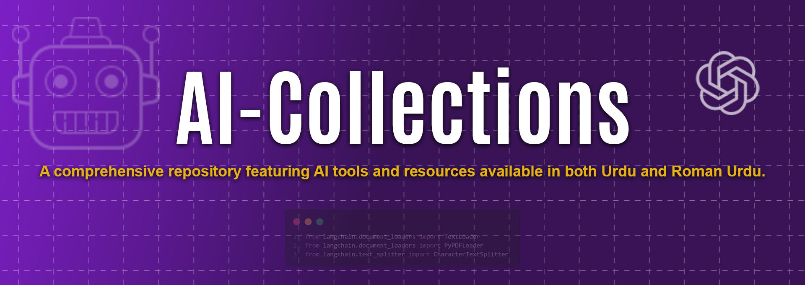

# AI-Collections 

---

    <i>Behtareen Generative AI Applications ka Majmua</i>
     

    <a href="./CONTRIBUTING.md">Contributing Guide</a> •
    <a href="LICENSE">License</a> •
    <a href="#">Blog</a>

---

Translations:
- Simple Urdu: [README.ur.md](https://github.com/ai-collection/ai-collection/blob/main/README.es.md)

---

### AI Collection par featured behtareen AI applications ki chuni hui list

Agar aapka AI application is chuni hui list mein jagah ka haqdaar hai, to barah-e-karam mujhe baat karain: <a href="mailto:huzaifatahir7524@gmail.com">Huzaifa Tahir ko Email bhejein</a>

## Index
- 🤖💬 [AI Chat Aur Assistant](#AI-Chat-Aur-Assistant)

---

## AI Chat Aur Assistant

### **ChatGPT Paid + Free**

    

Duniya ka sab se mashhoor guftagu ka madadgar. Apne sawalon ka jawab hasil karein aur durust jawab paayein.

ChatGPT ek mashhoor conversational AI hai jo aapke sawalon ke behtareen jawab dene mein madad karta hai. Yeh paid aur free dono versions mein available hai.

**[Explore ChatGPT](https://chat.openai.com/)**

### **Claude AI Paid + Free**

    

Ek AI madadgar jo barhti hui salahiyat aur shaandaar performance ke saath hai. Iska context window lagbhag ek million tokens tak pohnchta hai.

Claude AI aik advanced AI assistant hai jo har din naye features aur behtareen performance ke saath develop ho raha hai. Iska context window ek million tokens ke qareeb hai, jo iski processing capabilities ko bahut behtar banata hai.

**[Explore Claude AI](https://claude.ai)**

### **Gemini AI**

    

Google ka ek powerful AI chat assistant jo performance mein ChatGPT ko takraata hai.

Gemini AI, Google ka advanced AI chat assistant hai jo ChatGPT ke saath performance ke maamle mein compete karta hai, aur high-quality interactions aur answers provide karta hai.

**[Explore Gemini AI](https://gemini.google.com/)**

### **Poe Free**

    

Quora se powered ek AI jo aapke har sawal ka jawab de sakta hai.

Poe ek AI hai jo Quora ke zariye power hota hai aur har tarah ke sawalon ka jawab dene mein mahir hai. Yeh free version mein available hai.

**[Explore Poe](https://poe.com)**